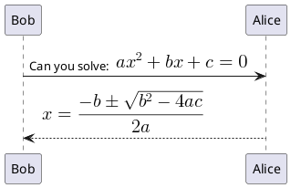

Building a Product API using Flask and SQLAlchemy and Marshmallow
==================================================================

The application contains a product API built using the micro framework Flask. Flask-SQLAlchemy
is a flask extension that provides support for SQLAlchemy, which is a Python toolkit and is also a powerful
object relational **(OR)** mapper. This lets the application perform  **CRUD** operations. Since it is a product API, products are
addec to the database. 

Quick Start Installation Guide 
------------------------------

1. Set up a virtual environment.
2. Add the necessary dependencies. 

    **eg: pip install flask, flask_restful** 


# SIR Epidemic Modeling


The SIR model is one form of epidemic modeling. It was first proposed by Kermack-McKendrick in 1927.
Individuals who are born into the system with no immunity are called susceptible.
Individuals who are affected by the epidemic are called infected. Infected individuals who receive treatment and respond well to it are called recovered.
For the task, the model has been written in the following ordinary differential equation:


$$\int_{a}^{b} x^2 dx$$

\begin{equation}
\frac{\partial Q}{\partial t} = \frac{\partial s}{\partial t}
\end{equation}
``` plantuml
@startuml
<math>x^2+y_1+z_12^34</math>;
@enduml
```
`$$a^2 + b^2 = c^2$$`

`$$\begin{vmatrix}a & b\\
c & d
\end{vmatrix}=ad-bc$$`

